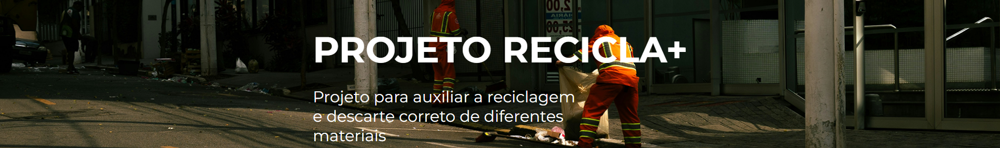

# ♻️ Recicla+ – Plataforma Educativa sobre Sustentabilidade

## 📌 Visão Geral do Sistema

Desenvido por mim como **Product Master**, e o **Team** Adonay Roque (nullaron), Sarah Germano e Bianca Serafim como atividade do primeiro semestre do curso de Ciência da Computação na Universidade Paulista (UNIP). 

Com a proposta de criar um website educativo com base em algum Objetivo de Desenvolvimento Sustentável (ODS), o **Recicla+** é uma aplicação web front-end desenvolvida com o objetivo de promover a conscientização ambiental por meio da educação sobre reciclagem e consumo responsável.

O sistema foi estruturado como um site institucional multi-páginas, onde cada seção possui uma função específica dentro da experiência do usuário, formando um fluxo informativo contínuo.

A aplicação foi desenvolvida utilizando apenas tecnologias front-end, sem backend ou banco de dados, sendo hospedada por meio do **GitHub Pages**.

---

## 🧠 Arquitetura do Projeto

O sistema segue uma arquitetura simples baseada em separação de responsabilidades:

- **HTML5** → estrutura e organização do conteúdo
- **CSS3** → estilização visual e layout responsivo
- **JavaScript** → interações dinâmicas e manipulação do DOM

Além disso, o projeto utiliza componentes reutilizáveis como **navbar e footer**, garantindo padronização visual entre as páginas.

---

## 🌐 Estrutura do Site

O sistema é composto pelas seguintes páginas:

- **Home** → apresentação do projeto e conteúdo interativo sobre reciclagem  
- **ONGs** → apresentação de organizações reais ligadas à sustentabilidade  
- **Sobre Nós** → identidade do projeto, missão, visão e valores  
- **Contato** → formulário de interação com feedback dinâmico ao usuário  

O fluxo de navegação foi projetado para ser simples e intuitivo, permitindo que o usuário percorra o conteúdo de forma progressiva.

---

## ⚙️ Funcionalidades

- Estrutura multi-páginas com navegação entre seções
- Seção dinâmica na Home com troca de conteúdo via JavaScript
- Cards informativos sobre materiais recicláveis
- Apresentação de ONGs com links externos
- Página institucional com missão, visão e valores
- Formulário de contato com validação e popup de confirmação
- Interface responsiva baseada em Flexbox
- Componentes reutilizáveis (navbar e footer)

---

## 🧪 Tecnologias Utilizadas

- HTML5 (estrutura semântica)
- CSS3 (Flexbox, posicionamento e responsividade)
- JavaScript (DOM e interatividade)
- GitHub Pages (hospedagem)

---

## 📊 Limitações do Projeto

Esta versão não possui:

- Backend
- Banco de dados
- Sistema de autenticação
- Armazenamento de mensagens do formulário
- Sistema de métricas de uso real

Essas funcionalidades podem ser implementadas em versões futuras, evoluindo o sistema para uma aplicação full-stack.

---

## 💬 Participação de Cada Integrante

- Marcos Vinicius: Gestão, desenvolvimento, documentação, prototipação
- Adonay Roque: Gestão, desenvolvimento, prototipação, documentação
- Sarah Germano: Diagramação e documentação
- Bianca Serafim: Documentação e prototipação

---

## 🚀 Acesso ao Projeto

O projeto está disponível online através do GitHub Pages:

🔗 https://marcsvmj.github.io/MultiPage_Recicla/

---

## 👨‍💻 Desenvolvimento

Projeto desenvolvido como prática acadêmica de desenvolvimento web front-end, com foco em:

- Estruturação de aplicações web
- Organização de código
- Experiência do usuário
- Boas práticas de HTML, CSS e JavaScript

---

## Outras Fontes do Projeto

- Documentação: Foi utilizado o **Documentos Google**, visando automação e facilidade de edição com apoio visual.
Link: https://docs.google.com/document/d/1uPY7U7lSJyUGRi5tBkV4Qb10jauahceOL96xP3MabGg/edit?usp=sharing

- Prototipação: Foi utilizado o software **Figma**, visando aplicação real no mercado.
Link: https://www.figma.com/design/46o8NvIrd87Cm3X31rVHyN/PD1-UNIP---PROT%C3%93TIPO?node-id=0-1&t=apZaYVmWCbChIM5b-1

---

## 📌 Observação

Este projeto pode ser utilizado como referência educacional e de aprendizado em desenvolvimento web, respeitando sua estrutura original.
